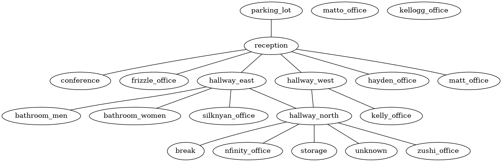

# Office Files

Office files are a subset of the [graphviz DOT language][dot].
This gives you the ability to easily generate graph images representing your office layout.

A very simple example of an office would be:


> **Note:** a room with id `parking_lot` is currently hard-coded as the enterance to every office. So it is required for each office to have a `parking_lot`. It probably took more keystrokes to type this message than it would take to just make it configurable.

## Syntax

### Office Setup

An office is defined as a graph with optional properties.
Only one office per file is supported at the moment.

```
# <property>: <value>
graph <office_id> {
    <rooms>
    <room_connections>
}
```

Valid properties:
- `name: <name>` gives a human-friendly display name to the room

### Rooms

Rooms are defined as a room ID with optional properties.

```
# <property>: <value>
<room_id>
```

Valid properties:
- `name: <name>` gives a human-friendly display name to the room.
- `voice: enabled` adds a voice channel to this room in discord.
- `has: <item_id>` adds an item to a room. Rooms can have multiple items. This does nothing presently.

### Room Connections

Connecting rooms together with `--`. This is a bidirectional connection.

```
<room_id> -- <room_id>
```

## Gallery

### Anime was not a mistake office

The original office.




### Test Lab

Used in integration tests.


[dot]: https://en.wikipedia.org/wiki/DOT_(graph_description_language)
